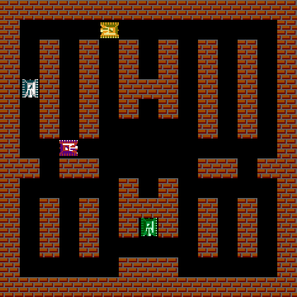
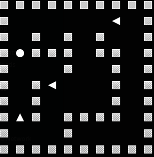

# Tankstar
This is simplified clone of Battle City game that uses A* algorithm.

## Setup
Clone the repository and create virtual environment.  After that install requirements.

    git clone https://github.com/alexandr-gnrk/tankstar.git
    cd huntsman
    python3 -m venv ./venv
    source ./venv/bin/activate
    pip3 install -r requirements.txt

Run the game:
    
    python3 tankstar.py 

## Usage
    usage: tankstar.py [-h] [-m {gui,console}]

    Simplified Battle City clone

    optional arguments:
      -h, --help            show this help message and exit
      -m {gui,console}, --mode {gui,console}
                            game mode
### Bots
Green tank - controlled by the player.

Red tank - trying to attack from the front.

Yellow tank - trying to attack from behind.

Gray tank - always moves straight and turns in random direction when it encounters an obstacle.

### Controls
Keys | Action
------------ | -------------
UP/DOWN | Move forward/backward
LEFT/RIGHT | Turn clockwise/anticlockwise
SPACE | Shoot
R | Restart the game
Q | Exit

## Screenshots
### GUI mode

### Console mode
